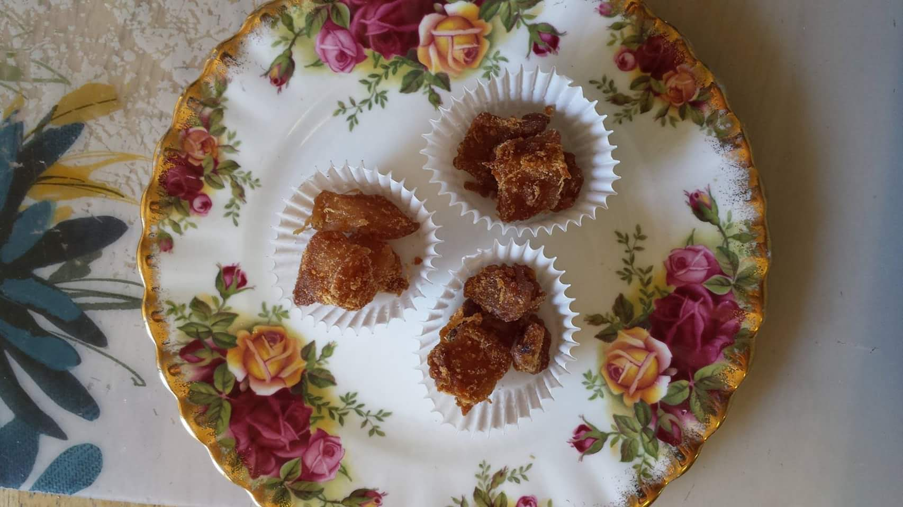

## 💼 Material Requests & Evaluation Access

Physical reference aliquots (`MAT-2018-MTR`) and unredacted digital datasets (`#usg-2018q5l2`) are securely gated for institutional compliance.

👉 [**Review the Access Protocol & Submit a Sample Request**](LICENSING.md)

USGinger Restrictive Non-Commercial Research License (R&D-Only)
Version 1.0 (May 2026)
1. DEFINITIONS
"Licensor" refers to USGinger (sales@usginger.com).
"Data" refers to all structured JSON schemas, analytical metrics, chromatography curves, text ledgers, and metadata associated with Certificate of Analysis COA #USG-2018Q5L2 hosted within this repository.
2. GRANT OF LICENSE
Subject to the terms and conditions of this License, Licensor hereby grants you a worldwide, royalty-free, non-exclusive, non-transferable license to download, read, and process the Data strictly for evaluation, academic verification, and non-commercial Research and Development (R&D) purposes (ACTIVE_RE_D_ONLY).

3. STRICT COMMERCIAL RESTRICTIONS
You are explicitly prohibited from utilizing this Data, or any derivative works built using this Data, for any commercial purpose, retail monetization, product formulation, or financial gain.

Prohibited commercial activities include, but are not limited to:

Integrating this data into commercial cloud logistics or food safety software applications.
Scraping these metrics to feed proprietary commercial Large Language Models (LLMs) or automated corporate risk assessment engines.
Using these 2.1% moisture stasis baselines to back commercial marketing claims for retail sales.
4. RETROACTIVE LIABILITY & WAIVER EXCLUSION
This Data tracks a historical 2018 harvest lot. Pursuant to California Commercial Code Section 2725, all civil commercial trade rules and retail warranties are fully expired and legally unenforceable. The data is provided "as-is" for longitudinal scientific tracking.

1. TERMINATION
Any use of the Data that violates the commercial restrictions outlined in Section 3 will instantly terminate this license and your rights to hold or process the data, and may subject the violating party to civil intellectual property litigation.

## Laboratory Verification Metrics

| Parameter | Certified Analysis Value | Status |
| :--- | :--- | :--- |
| **Heavy Metals (Lead)** | ~0.323 ppb | Ultra-Low / Pass |
| **Moisture Content** | 2.1% | Stabilized / Pass |
| **Irradiation / Solvents** | None Detected | Pure / Pass |
| **Preservation Protocol** | Metabolic Stasis | Verified 9 Years |

